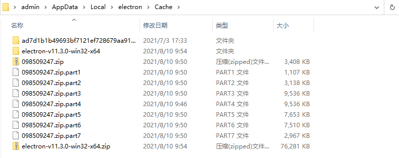
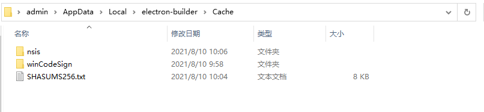

# task-pc-ui

# 开发事项

## electron 主进程 background.js

> src/background.js

不准引入、import、 包含任何document，html, element-ui 等文档类型 的js 文件 或组件，否则会造成 进程 main.js 报错

不准使用以 `@` 路径的引用

## main.js 工具类

> src/utils/pure.js

不准引入、import、 包含任何document，html, element-ui 等文档类型 的js 文件 或组件，否则会造成 进程 main.js 报错

不准使用以 `@` 路径的引用

# 打包配置

`Admin` 是你的电脑用户名，请根据自己实际情况配置

下载 electron-v11.3.0-win32-x64.zip

> https://npm.taobao.org/mirrors/electron/11.3.0/electron-v11.3.0-win32-x64.zip

解压放到 C:\Users\Admin\AppData\Local\electron\Cache 目录下

下载SHASUMS256.txt

> https://npm.taobao.org/mirrors/electron/11.0.0/SHASUMS256.txt

重命名为SHASUMS256.txt 放到 C:\Users\Admin\AppData\Local\electron\Cache 目录下

下载 winCodeSign

> https://npm.taobao.org/mirrors/electron-builder-binaries/winCodeSign-2.6.0/

解压放到C:\Users\Admin\AppData\Local\electron-builder\Cache\winCodeSign\winCodeSign-2.6.0目录下

nsis-3.0.4.1

⨯ Get "https://github.com/electron-userland/electron-builder-binaries/releases/download/nsis-3.0.4.1/nsis-3.0.4.1.7z": dial tcp 52.74.223.119:443: connectex: A connection attempt failed because the connected party did not properly respond after a period of time, or established connection failed because connected host has failed to respond.

https://npm.taobao.org/mirrors/electron-builder-binaries/nsis-3.0.4.1/

解压放到C:\Users\Admin\AppData\Local\electron-builder\Cache\nsis\nsis-3.0.4.1 目录下 没有的话，自己创建nsis-3.0.4.1

### electron



### electron-builder




# 打包注意事项

1. 设置 `package.json` 中的 `version` 和 `buildTime`， 检查打包热更新地址： `/dist_electron/default-app-update.yml` 和 `dist_electron/win-unpacked/resources/app-update.yml`

2. 检查 `.env` 文件, 检查配置信息

3. 检查 `router` 路由配置

4. 检查 `vue.config.js` 配置

5. 打包后将 `dist_electron` 中的文件上传至服务器热更新文件夹，注意要将服务器端以前的上个版本的文件全部删除，而不是覆盖，不然会无法更新

# 修改更新

> node_modules/electron-updater/out/AppUpdater.js

```js
const pkg = require('../../../package.json')
const isLatestVersionNewer = (0, _semver().gt)(latestVersion, pkg.version);
```

# 程序日志

> C:\Users\{用户名}\AppData\Roaming\Task-manager\logs
 
# 文档

 - [IM 接口文档](./IM接口文档.md)
 - [视频会议文档](./视频会议文档.md)
